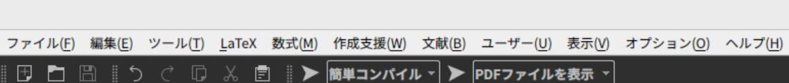
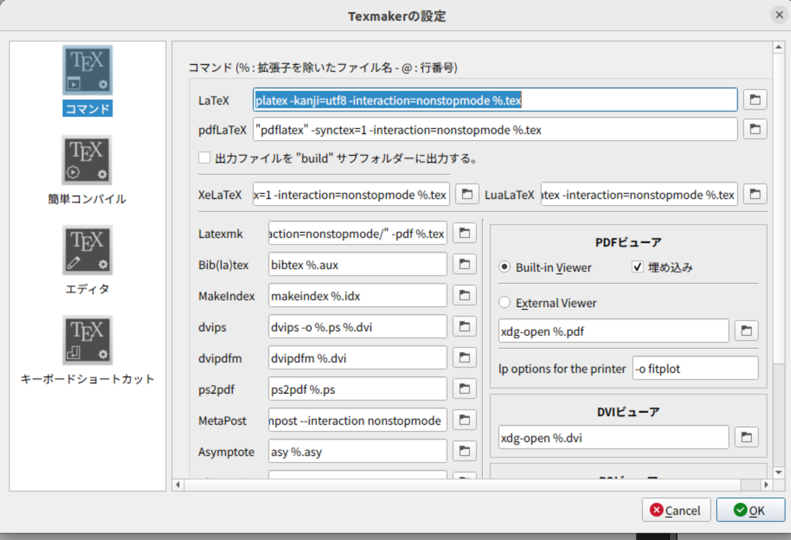

# UbuntuでTeXmakerの日本語化（UI+日本語対応)

こんにちは。　　
早速ですが、TeXmakerの日本語化にちょっと苦戦したので、解決方法を載せます<br>

- UIの日本語化
- 日本語でもエラー無くコンパイルする

2つに分けて記事を書きます。

## UIの日本語化

### 既存手法

- ネットに転がっている手法として、『TeXmakerのUI日本語化』は以下のように行います
  1.  texmaker_jp.qmというファイルをインストールする
     1. 正確には、解凍したらtexmaker_jp.qmがでてくるようになってます。
  2. texmaker_jp.qmをtexmaker.exeと同じフォルダーに置く
  3. texmakerを起動して、『オプション』→『インターフェース言語』→『jp』を選択する
  4. texmakerを再起動する

こんな感じです。<br>

一見、何の変哲も無い作業工程ですが、1と2の工程で若干詰まるので、順にやっていきましょう。<br>

### 実際に俺が使ったUIの日本語化

#### 1.texmaker_jp.qmというファイルをインストールする

- ここでの罠
  - texmaker_jp.qmどこにあるねん問題
  - ブログなどでリンクを貼っているページもありますが、『LaTeX日本語化ファイル』と調べてもでてきません
    - 僕はたまたま丁度いいサイトを見つけたので問題無かった
- 解決方法
  - [TexMaker で日本語文書を作成する環境を構築する(ワイズというサイト？)](https://wiis.info/blog/how-to-write-japanese-documents-with-texmaker/)から引用させていただきます。
  - このサイトにある、『TexMaker日本語化ファイル』というのをダウンロードしてください
    - 公式のページで日本語化ファイルがおいてあるところを見つけられませんでした。
  - ダウンロードしたら、解凍して、texmaker_jp.qmが出来たことを確認してください。

#### 2.texmaker_jp.qmをtexmaker.exeと同じフォルダーに置く

- ここでの罠

  - texmaker.exeどこにあるねん問題

    - ```
      find texmaker.exe
      which texmaker.exe
      ```

    - どれをやっても見つかりません…

    - そもそも僕はファイルを探すコマンドを知りません（知っている人いたら教えて〜）

- 解決方法

  - ```
    sudo apt plocate
    ```

    - locateコマンドを使えるようにします。（すでにある人は不要)

  - ```
    locate texmaker
    
    ```

    - (ちなみに locate texmkaer.exeをしてもヒットしないよ＞＜）

  - ```
    /usr/share/texmaker/texmaker_it.qm
    /usr/share/texmaker/texmaker_lv.qm
    /usr/share/texmaker/texmaker_nl.qm
    /usr/share/texmaker/texmaker_pl.qm
    /usr/share/texmaker/texmaker_pt.qm
    /usr/share/texmaker/texmaker_pt_BR.qm
    /usr/share/texmaker/texmaker_ru.qm
    ```

  - 上みたいな感じで多数ヒットします。

  - ```
    /usr/share/texmaker/
    ```

    という階層にqmファイルをおけばいいらしいので、

    ```
    sudo mv texmaker_jp.qm /usr/share/texmaker
    ```

  - これで完成です。 

#### 3.texmakerを起動して、『オプション』→『インターフェース言語』→『jp』を選択する

- ここは難なくできると思います。
- この段階では英語まだ英語ですが、頑張って『option』や『interface language』を探してください

#### 4.texmakerを再起動する

- 日本語で表示される！！！
- 

## 日本語でもコンパイルするための手法

### 既存手法

- なんか色々あるらしい
- [どくとる・めも](https://beeft.hatenablog.com/entry/2021/01/31/183520)さんのページが非常に参考になりました。
  - というかこれだけで解決出来た

### 実際に俺が使った手法

- とりあえず、テスト用のLaTeXとして、これをあげます。
  - 新規ファイル作成から、test.texみたいな感じで、とりあえずファイルを作ります

```
\documentclass[14pt]{beamer}
\usetheme{Antibes}
\usepackage[utf8]{inputenc}
\usepackage{amsmath}
\usepackage{amsfonts}
\usepackage{amssymb}
\author{にぼし}

%\title{てすと }

\begin{document}
\begin{frame}

\titlepage
\end{frame}

%\begin{frame}
%\tableofcontents
%\end{frame}

\begin{frame}{ほげ}
ふが
\end{frame}
\end{document}
```

- このままコンパイルするとエラーがでます

- そこで、『[どくとる・めも](https://beeft.hatenablog.com/entry/2021/01/31/183520)さんのページ』の設定を写経します。

  - どこを変更したらいいの？

    - よくわかりませんが、ぶっちゃけ変更するのは数個で良さそうです。

      - copy用に置いとくね！！

      - ```
        platex -kanji=utf8 -interaction=nonstopmode %.tex
        ```

      - ```
        "pdflatex" -synctex=1 -interaction=nonstopmode %.tex
        ```

    - 

    - この、ハイライトした部分と、その下の『pdfLaTeX』の中の 'pdflatex'をダブルクオーテーションで囲むだけでokな気がします！
      - だめだったらごめん！リンク先のページ見て差分見つけて写経して！

- これで実行したら、日本語のスライドになるのでは？

  - 

  

## 終わりに

雑談タイムです<br>

- そもそもなんでLaTeXの話か？

  既存のスライド作成手法が疲れたからです。　　
  パワポはpptxファイルを研究室と自宅PCで共有するのがめんどくさくなった（gitでpushして共有していた)。そこで、google slideに乗り換えたのですが、パワポみたいなテンプレート機能を使いこなせなかったり、なんかうまくいきませんでした。

  

  そこで、LaTeXでスライドを作れると聞いたことがあったし、論文書く際にword使いたくないなあ（未来視）したので、LaTeXを使ってみることにしました。

- LaTeXの経験

  ほぼ無いです。競プロで解説するときに、markdownの中に $$b_i = b_{i-1}+a[i]$$ みたいな感じでちょっとした数式を入れることしか出来ません。

  でもなんか、論文書く段階にLaTeX初めて触ったけど出来た。っていう頭のいい友人の話を聞いたので、軽いノリで入れてみました

- overleafは？

  ブラウザ上でLaTeXが扱えるらしい。でもなんか、日本語コンパイルがうまく行かなかったり、調べてみると『サーバーが消し飛ぶ』ことがあるらしくて、コレはやばいと思ってローカルの環境構築（TeXmaker)をしました。

  - ところで、ファイル共有がめんどうでLaTeXを触ったのに、結局これではファイル共有の問題が残りますね；；

- 以上

  - ありがとうございました。